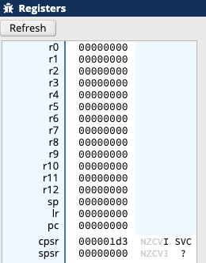
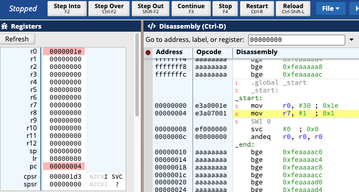
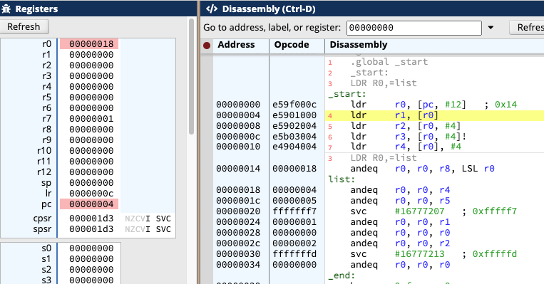
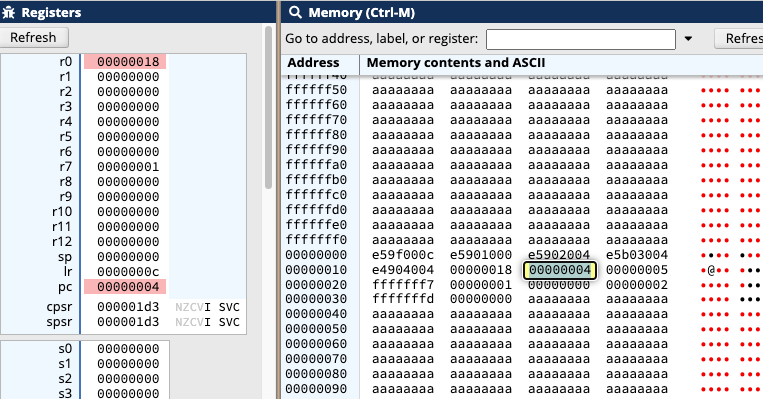
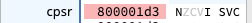
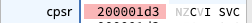

## Intro and Setup

- 教学使用的在线模拟器：https://cpulator.01xz.net/
- 使用的芯片：Armv7

- 课程主要讲 Assembly language 的一般化概念。虽然针对的是 ArmV7 ，但可以快速应用到其他的架构上。

## Emulation and Memory Layout

**Register** 寄存器是 CPU 可以直接操作的存储区域，读写速度非常快，但容量很小。



- 每个寄存器，大小为 4 bytes，32 bits。
  - 上图中每个 `0` 为 16进制表示形式，每个寄存器有 8 个数字，也就是 4 bytes 大小。
  - 寄存器的大小和 processor 的字宽是一致的，这里 ArmV7 是 32 位处理器。
  - 这里 32bit 也称为一个 **word**
- 每个 register 的功能：
  - register 0 到 6 为 general purpose registers
  - Reg 7 一般用作 system call
  - Reg `sp` 表示 stack pointer
    - stack memory 在 RAM 上，其读写速度稍慢一点，但容量很大，可用于存储 more complex sets of data
  - Reg `lr` 表示 link register
    - 用于存储主调函数的调用指令地址，也就是当前函数返回后，将会执行的命令的地址。
  - Reg `pc` 表示 program counter
    - 用于记录下一条将要执行的命令的地址。
  - Reg `cpsr` (Current Program Status Register)，包含了一些 operation flags
    - 用于存储 program 的相关信息，比如是否为补码，是否 overflow等
  - Reg `spsr` (Saved Program Status Register)
    - 用于在异常发生时，暂存 `cpsr`, 用于后续的异常恢复

## Your First Program

```assembly
.global _start
_start:
  MOV R0,#30
  MOV R7,#1
  SWI 0
```

- `.global _start` 用于指示程序的执行入口地址
  - `.global` 用于告诉外部本程序的起始 label
- `_start:` 是一个 label，label 可以看作是高级语言的 function。
  - 通过 label 可以讲整个代码分解为若干个 code segment。当你 go to 某个 label，就会去执行这个 label 下的代码指令。
- `MOV R0,#30` 将整数字面值 `#30` 拷贝到 `R0` 寄存器中
  - 指令和寄存器名称是大小写不敏感的。大写只是一种风格
  - `MOV` 指令的格式为 `MOV <dest>,<src>`
  - 整数字面值以 `#` 开头，这里的 `30` 为十进制，可以用16进制形式，如 `#0x1e`
- System call 分为两步：set syscall number 和 call sys interrupt.
  - 设置 syscall number: `MOV R7,#1`
    - `R7` 是用于系统调用的寄存器
  - `SWI 0` 表示 software interrupt
    - 该指令中断 program 的执行，将控制权转移给 OS
  - OS 获得控制权后，会读取 `R7` 值，查询 lookup table，获取 syscall 执行入口地址
    - syscall number `#1` 表示退出程序，那么这个 syscall 就会终止退出当前 program

### Emulator 操作

- 在 editor tab 写完程序，点击 `Compile and Load (F5)` 按钮；emulator 会切换到 Disassembly tab。
- 在 Disassembly tab，点击上方菜单 `Step Over` 可以单步执行程序，



- 上图为执行一步后的结果：`R0` 寄存器的结果已经变成了 `0x1e`，同时 `PC` 寄存器的值为 `0x4`，指向 set syscall number 的指令。

## Addressing Modes

- 前一节中，将字面值加载到寄存器中的指令，`MOV R0,#5`，访问数据的方式称为 **immediate addressing**。
  - 因为数据是直接嵌在指令中的，可以直接获取
- 将数据从一个寄存器拷贝到另一个寄存器，`MOV R1,R0`，称为 **register direct addressing**
- 将数据从 stack memory 加载到寄存器的操作有三种：**register indirect addressing**, **pre-increment addressing** 和 **post-increment addressing**。
- stack memory 上的数据，通过 `.data` section 进行创建。

```assembly
.global _start
_start:
  LDR R0,=list
  LDR R1, [R0]
  LDR R2,[R0,#4]
  LDR R3,[R0,#4]!
  LDR R4,[R0],#4

.data
list:
  .word 4,5,-9,1,0,2,-3
```

- `.data` 表示 program 的 data section
- `list:` label 表示一个变量
  - `.word` 表示每个值的大小
  - `4,5,...,-3` 多个值，依次存储在 stack memory 上的连续内存块上 
- `LDR R0,=list` 将 `list` label 的地址加载到 `R0` 中
- `LDR R1, [R0]` 将 `R0` 中的地址所指向的内存内容，加载到 `R1`
- indirect addressing `LDR R2,[R0,#4]`，将 `R0` 中地址增加 4 个字节后所指向的数据，加载到 `R2` 中。操作后 `R0` 内的值不变。

- Pre increment addressing `LDR R2,[R0,#4]!`，先将 `R0` 中的地址增加 4 个字节，然后加载 `R0` 地址所指向的数据。
- post increment addressing  `LDR R2,[R0],#4`，先加载 `R0` 中地址所指向的数据，然后在将 `R0` 中的地址增加 4 个字节。





- 上面的程序执行第一步 `LDR R0,=list` 后，`R0` 内容为 `0x18`，即数据 `4` 的地址。
- 在 memory tab 中，`list` 数据连续地存储在 stack memory 上。
- 可以依次单步执行，来验证上面的 addressing modes。最终寄存器的结果为：`R0: 0x20`, `R1: 0x4`, `R2: 0x5`, `R3: 0x5`, `R4: 0x5`.

## Arithmetic and CPSR Flags

```assembly
.global _start
_start:
  MOV R0,#3
  MOV R1,#5
  ADD R2,R0,R1 ; R2 = R0 + R1
  SUB R3,R0,R1 ; R3 = R0 - R1
  MUL R4,R0,R1 ; R4 = R0 * R1
```

- `SUB R3,R0R1` 指令执行后，`R3` 寄存器结果为 `fffffffe`，这是 `-2` 的补码表示。
  - 但是，如果我们计算 `ffffffff - 1` 的话，结果也是 `fffffffe`，那么如何区分算数运算结果是一个非常大的正整数，还是一个负整数呢？
  - 这就需要用到 `CPSR` 寄存器。

在整数算数运算中，如果想记录结果是否溢出或为负，可以使用 `ADDS`, `SUBS` 等指令。这些指令在计算结果的同时，会更新 `CPSR` 的标志位。

```assembly
MOV R0,#3
MOV R1,#5
SUBS R2,R0,R1
```

上面代码执行后 `CPSR` 寄存器结果为下图。变黑的字母 `N` 表示计算结果为 Negative



```assembly
MOV R0,#0xFFFFFFFF
MOV R1,#2
ADDS R2,R0,R1
```

上面的代码执行后 `CPSR` 寄存器结果如下图，字母 `C` (carry) 变黑，表示溢出



标志位可以参与后续的运算，比如 `ADC R2,R0,R1` 表示 `R2 = R1 + R2 + carry`，其中 `carry` 可能为 0 或 1。

## Logical Operations

```assembly
MOV R0,#0xFF
MOV R1,#22
AND R2,R0,R1 ; R2 = R0 & R1
ORR R3,R0,R1 ; R3 = R0 | R1
EOR R4,R0,R1 ; R4 = R0 xor R1
MVN R0,R0 ; R0 = !R0
AND R0,R0,#0x000000FF
```

- `AND` 表示按位与操作。上面代码执行后，`R2` 的内容为 `#0x16`
- `ORR` 表示按位或操作。执行后，`R3` 的内容为 `#0xFF`
- `EOR` 表示按位异或操作，执行后，`R4` 的内容为 `#0xe9`

- `MVN` (move negative) 表示按位取反操作，上面侧指令执行后 `R0` 的内容变为 `0xFFFFFF00`
  - `MVN` 会对所有位取反，如果仅对有效位进行取反，可以再使用 `ADD` 操作进行 masking

## Logical Shifts and Rotation

- `LSL` Logical Shift Left，整数乘 2 的快捷操作

- `LSR` Logical Shift Right，整数除 2 的快捷操作

- `ROR` Rotation Right，常用于 hashing, crypto, graphics 等操作中

- 不存在 Rotation Left 操作

- `LSL R0, #2` 指令，表示 `R0` 寄存器中的值左移两位，也就是乘以 4
- `MOV R1, R0, LSL #1` 指令，表示将 `R0` 数据拷贝到 `R1`，然后左移一位
- `ROR R0, #1` 指令，表示 `R0` 寄存器中数据旋转一位
- `MOV R1, R0, ROR #1`，先拷贝再旋转

## Conditions and Branches


