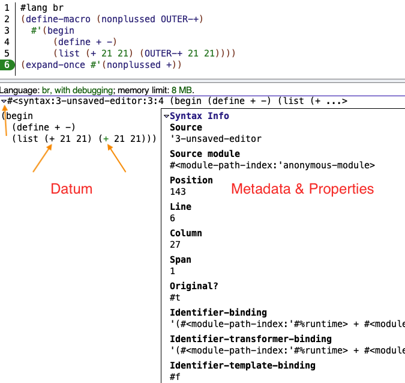

### 1. Syntax object

- A **syntax object** is a data structure native to Racket that holds everything you'd want to know about a piece of source code.

  - Syntax objects are used extensively within Racket's macro system.
  - A syntax object is not an "object" in the sense of OOP. Rather, it's just a data object, similar to a hash table.

- At minimum, a syntax object consists of:

  - A **datum** that represents the literal code as it would appear in a source file.

    A syntax object can be flattened into a datum with `syntax->datum`.

    ```scheme
    (syntax->datum #'foo) ; 'foo
    (syntax->datum #'(+ 1 2 3)) ; '(+ 1 2 3)
    ```

  - **Metadata** about the code, most importantly its **lexical context** and **source location**.

    ```scheme
    #lang br
    (define stx #'foo)
    (syntax-line stx) ; 2
    (syntax-column stx) ; 14
    (syntax-span stx) ; 3
    (syntax-srcloc stx) ; (srcloc 'unsaved-editor 2 14 24 3)
    ```

- Optionally, a syntax object can also contain:

  - **Syntax properties** that are arbitrary key-value pairs, which are setted and get with `syntax-property`.

    ```scheme
    (define stx #'foo)
    (define stx+prop (syntax-property stx 'hello "world"))
    (syntax? stx+prop) ; #t
    (syntax-property stx+prop 'hello) ; "world"
    ```

  - Other (sub) syntax objects, in place of any sub-datum.

    These nested syntax objects retain their original syntax properties and metadata, including lexical context.

    ```scheme
    (define-macro (nonplussed OUTER-OP)
      #'(begin
         (define + -)
         (list (+ 21 21) (OUTER-OP 21 21))))
    
    (syntax->datum (expand-once #'(nonplussed +)))
    ; '(begin (define + -) (list (+ 21 21) (+ 21 21)))
    (nonplussed +) ; '(0 42)
    ```

    - This macro binds the syntax argument to the pattern variable `OUTER-OP`.
    - The macro then uses `OUTER-OP` within a larger syntax object.
    - The expanded syntax object ends up with two variables named `+`: one defined inside of the macro, and the other defined outside. They retain separate lexical contexts.

### 2. Create Syntax object

- To create a syntax object in the current *lexical context*, simply wrap a datum with `syntax`, or equivalently prefix the datum with `#'`.

  ```scheme
  (syntax (+ 1 2))
  ; .#<syntax:2-interactions from an unsaved editor:5:10 (+ 1 2)>
  #'(+ 1 2)
  ; .#<syntax:2-interactions from an unsaved editor:7:4 (+ 1 2)>
  ```

  - The syntax prefix `#'` corresponds logically to the `'` prefix used to create a datum.

- To create a syntax object within a different lexical context, use `datum->syntax`. The first argument is a syntax object that carries the target lexical context, and the second argument is a datum.

  This is a common way of circumventing macro *hygiene*.

  ```scheme
  (define-macro (make-z OUTER-ID)
    (with-pattern ([Z-ID (datum->syntax #'OUTSIDE-ID 'z)])
      #'(define Z-ID 42)))
  (make-z out-here)
  z ; 42
  ```

  - 在 `make-z` macro 中，在外部 calling-site 的 lexical context 内创建了一个 identifier `z`，然后将其绑定到 `Z-ID` pattern variable 上。最后在 expanded syntax 中给 `z` identifier 绑定 value `42`。

### 3. Inspect Syntax object

- 打印在 REPL 中的 syntax object 可查看其内部结构。

  ```scheme
  (define-macro (nonplussed OUTER-+)
    #'(begin
       (define + -)
       (list (+ 21 21) (OUTER-+ 21 21))))
  (expand-once #'(nonplussed +))
  ```

  上面代码中 `expand-once` 返回了 `(nonplussed +)` 宏调用一次展开后的 syntax object。

  

  - 在 REPL 界面上，点击左边的三角符号，可以展开 syntax object。
  - 展开后，左边显示 datum，右边显示选中的 datum part 的 metadata 和 property 信息。
  - 分别点击 macro 展开后的两个 `+` identifiers，可以它们的 source location 是不同的。

### 4. Edit Syntax object

- The easiest way to deconstruct a syntax object is with a **syntax pattern**, which offers regex-style matching to break a syntax object into pieces.

  - Forms like `define-macro` and `define-macro-cases` use syntax patterns to match the input arguments.
  - Forms like `with-pattern` can be used inside a macro to further disassemble syntax objects and rearrange them.

  ```scheme
  (define-macro (rearrange XS)
    (with-pattern ([(1ST 2ND 3RD) #'XS])
      #'(list 3RD 2ND 1ST 3RD)))
  (rearrange (10 20 30)) ; '(30 20 10 30)
  ```

  - When a pattern variable appears in a syntax pattern, it doesn't have a `#'` prefix, because it doesn't represent a standalong syntax object.

    But when that pattern variable appears in the right side of a pattern clause or in the body, like `#'XS`, it is acting as a syntax object, so it needs the syntax prefix (and the `XS` is implicitly replaced with the matched value).

- For finer control, `syntax-list` can turn a single syntax object with a list-shaped datum into a list of syntax objects.

  ```scheme
  (syntax->list #'(1 2 3))
  ; '(#<syntax:2:17 1> .#<syntax:2:19 2> .#<syntax:2:21 3>)
  ```

  The dismantled list of syntax objects, can be manipulated with ordinary list operations to build new syntax objects.

  ```scheme
  (define-macro (rev ARGS)
    (define arg-stxs (syntax->list #'ARGS))
    (with-pattern ([(REV-ARGS ...) (reverse arg-stxs)])
      #'(list REV-ARGS ...)))
  (rev (10 20 30)) ; '(30 20 10)
  ```

- `quote` operator (`'`) 有对应的 `quasiquote` operators (`` ` ``, `,` and `,@`)。同样 `syntax` operator (`#'`) 也有对应的 `quasisyntax` operators (`` #` ``, `#,` and `#,@`)。

  ```scheme
  (define num 1)
  (define nums '(2 3))
  `(+ ,num, @nums) ; '(+ 1 2 3)
  #`(+ #,num #,@nums) ; #<syntax:8:2 (+ 1 2 3)>
  ```

### 5. Syntax properties

- Syntax properties are used to attach extra metadata fields to a syntax object.

  - 比如来自 `#lang br` 的 `read-syntax` 函数会 attach a `'paren-shape`  property to indicate whether the source code used square or curly brackets to delimit a list.

    ```scheme
    (define stx1 (read-syntax #f (open-input-string "(1 2)")))
    (syntax-property stx1 'paren-shape) ; #f
    (define stx2 (read-syntax #f (open-input-string "[1 2]")))
    (syntax-property stx2 'paren-shape) ; #\[
    (define stx3 (read-syntax #f (open-input-string "{1 2}")))
    (syntax-property stx3 'paren-shape) ; #\{
    ```

    With a syntax property, we can preserve the extra information without affecting the meaning of the syntax object.

    In this case, if we wanted to convert the syntax back to a string, we could still recover the original shapes.

    ```scheme
    (require syntax/to-string)
    (define stx (read-syntax #f (open-input-string "([2])")))
    (syntax->string stx) ; "[2]"
    ```

- Generally, syntax properties are useful because macros have a limited interface.

  - Syntax properties can be used to stash other information so that macros can use them, without affecting the input and output.

  ```scheme
  (require (for-syntax racket-list))
  
  (define-macro (echo ARG)
    (define how-many (or (syntax-property #'ARG 'count) 1))
    (with-pattern ([ARGS (make-list how-many #'ARG)]
                   [ARGLIST (cons #'list #'ARGS)])
       #'ARGLIST))
  (echo "foo") ; '("foo")
  
  (define-macro (twice ARG)
    (with-pattern ([ARGPLUS (syntax-property #'ARG 'count 2)])
      #'(echo ARGPLUS)))
  (twice "bar") ; '("bar" "bar")
  ```

### 6. Why not just use String

- Syntax objects are the foundation of hygiene, which is what makes the sophisticated macro system possible.

  - Hygiene is the idea that a code fragment floats within a bubble of bindings (provided by its lexical context), thereby permitting clean, predictable interactions between those fragments.
  - The syntax object creates that bubble by associating a lexical context with a code fragment.

- If syntax objects are so great, why don't other languages have them?

  Those languages don't have hygienic macros, so there's no need.

  Instead, many language have an `eval` or `exec` function that will treat a string as source. For instance Python:

  ```python
  eval("6 + 7 * len('this string')")
  ```

  But, in Racket, a syntax object is more idiomatic and clear.

  ```scheme
  (define stx #'(+ 6 (* 7 (string-length "this string"))))
  (eval stx) ; 83
  ```

  

