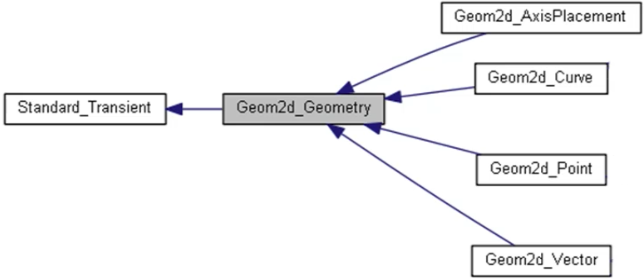
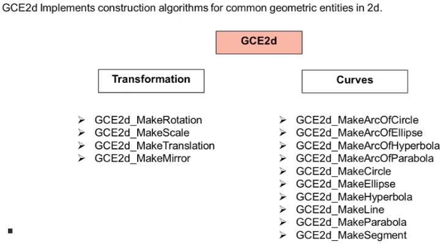

## Learn OCCT for 3D App Dev

课程内容概要：

- Learn basics of OCC 3D kernel based on OpenGL
- Learn how to create 2D/3D geometric entities in OCC
- Learn how to create topological entities like vertex, edge, wire, face and solid
- Create program for 3D operations like extrude, revolve, shell, sweep etc.
- Use Visualization module to display 3D objects
- Learn to setup MFC project for GUI development
- Create your own 3D modeling application

Open CASCADE is a C++ library built on top of OpenGL graphics library and designed for rapid production of domain-specific CAD/CAM/CAE applications.

## Introduction

### 1. Open Cascade Kernel:

- Basic:
  - Models
  - C++ Classes
  - Modeling algorithms
  - Application Framework
  - Data Exchange
- 2D/3D geometry
  - Geometry package
  - Point, Line, Curve
  - Surface
- 3D Modeling
  - Topology API
  - 3D operations
  - Boolean operations
- Visualization
  - Graphic display
  - Interactive selection
  - Custom 3D objects

### 2. 3D Graphics with OpenGL

- **Computer Graphics** is a method to convert geometric description of an object into visual model for presentation.

  

  - App 通过调用 OpenGL APIs，在屏幕上绘制几何模型

- **OpenGL** 提供了精简的硬件独立的渲染接口库。

  - Convert the geometric description of objects into pixels on the screen. This process is called rasterization (光栅化).
  - Features:
    - Coordinate systems (右手坐标系)
      - 全局坐标系，局部坐标系
    - Construct shapes from **geometric primitives** like points, lines, polygons, images, and bitmaps.
    - Color
    - Camera
    - Projection: Orthographic (正交投影), Perspective (透视投影)
    - Transformations: Translate, Rotat, Scale.
  - OpenGL 的 API 比较底层，OpenCascade 基于 OpenGL 提供了更加易用的高级 APIs。
    - 

## Open Cascade: Framework (OCC)

### 3. OCC Architecture

OCCT library 分为六个 modules：

- **Foundation classes**: contains data structures and services used by other modules.
- **Modeling data**: implements data structures to store 2D/3D geometric and topology data.
- **Modeling algorithms**: Implements topological and geometric algorithms.
- **Visualization**: provides algorithms to create graphic presentation of 2D/3D objects.
- **Data Exchange**: provides algorithms to read and write STEP/IGES files
- **Application Framework**: Handles Application data to simplify the development of a CAD application.
- 

Module 的内部结构：

- Package: a package contains classes, enumerations, exceptions and functions.
- Toolkit: It is a shared library (`dll`/`so`) with several packages.
- Module: contains several toolkits and other resources.
- 

### 4. OCC Foundation Classes - 1

Foundation Module 的结构：

- 

Standard Package 提供了一些 root classes

- 基础的标量类型

- `Standard_Transient` 是所有需要动态内存分配 classes 的 root class

- `Handle` 是 OCC 提供的 smart pointer，一般用来管理 `Standard_Transient` 子类的对象。

  

- RTTI (runtime type information) 提供检查运行时对象实际类型的服务。`Standard_Type` 提供了两个相关的 macros:

  ```c++
  #define DEFINE_STANDARD_RTTIEXT(Class, Base)\
  public:\
  typedef Base base_type;\
  static const char* get_type_name() { return #Class; OCCT_CHECK_BASE_CLASS(Class, Base)}\
  Standard_EXPORT static const Handle(Standard_Type)& get_type_descriptor();\
  Standard_EXPORT virtual const Handle(Standard_Type)& DynamicType() const Standard_OVERRIDE;
  ```

  ```c++
  #define IMPLEMENT_STANDARD_RTTIEXT(Class, Base)\
  const Handle(Standard_Type)& Class::get_type_descriptor() { return Standard_Type::Instance<Class>(); }\
  const Handle(Standard_Type)& Class::DynamicType() const { return STANDARD_TYPE(Class);}
  ```

`NCollection` Package

- 

`TCollection` package

- 

`UnitsAPI` 提供了单位换算的服务：

- 

### 5. OCC Foundation Classes

#### `gp` package


```c++
// Create Points
gp_Pnt P1(0, 0, 0);
gp_Pnt P2(50, 0, 0);
// Define axis
gp_Ax1 axis(gp_Pnt(0,0,0), gp::DX());
// Define Direction Vector
gp_Dir aDir(0, 0, 1);
// Define Plane
gp_Pnt Pos(50, 0, 0);
gp_Dir Dir(1, 0, 0);
gp_Pln aPlane(Pos, Dir);
// Define Circle
gp_Pnt P(0, 0, 0);
gp_Dir D(0, 0, 1);
gp_Ax2 Ax(P, D);
gp_Circ gC1(Ax, 10);
// Define Ellipse
gp_Ax2d Ax(P1, D);
gp_Ellips2d gE(Ax, 50, 25);
```

#### `TColgp` package

这个 package 为一些常用的范型类型实例提供了类型别名。


#### `GeomAbs` package

这个 package 包含了各种 curves 和 surfaces 类型的枚举类


#### `ElCLib` 和 `ElSLib` packages

- `ElCLib` 代表 Elementary Curves Library
  - Provides functions for basic geometric computations on elementary curves such as conics and lines in 2D and 3D space.
  - It has functions to evaluate the parameters corresponding to a point on a 2D/3D curve from `gp` package
  - It has functions to convert 2D entities to 3D.
- `ElSLib` 代表 Elementary Surfaces Library
  - Provides functions for basic geometric computation on elementary surfaces.
  - It has funcctions to evaluate parameters corresponding to a point on an elementary surface from `gp` package.
  - It has functions to calculate isoparametric curves on an elementary surface.

#### `Bnd` package


## OpenCascade Visualization 1

### 6. AIS Framework

**Visualization** module provides algorithms to create graphic presentations of various 3D objects. It also supports a fast and powerful interactive selection mechanism.

Visualization 包含四个 toolkits:

- **TKService**: API for managing and creating presentations from primitive arrays.
- **TKOpenGl**: Implements the graphic driver using OpenGL libraries.
- **TKV3D**: API for working with interactive objects.
- **TKMeshVS**: It provides API for displaying meshes.

`TKV3D` toolkit 包含如下关键 Packages：

- **AIS**： Classes to implement interactive objects.
- **V3d**: Provides the services supported by the 3D viewer.
- **Prs3d**: Manages how objects are displayed.
- **PrsMgr**: Defines basic interfaces and tools for presentable object.
- **StdPrs**: Standard presentation algorithms for B-Rep shapes.
- **Select3d**: Implement selection (picking) services.

`TKService` toolkit 包含了如下 packages

- **Aspect**: Enumerations and structures to manage graphic properties of objects.
- **Graphic3d**: Create 3D graphic objects in a 3D viewer; Implement your own presentation algorithms.

**Application Interactive Services (AIS)** package provides the API which are used to manage selection and presentation of 3D objects.

- It creates the link between the GUI viewer and 3D objects for management of 3D data.

- It provides mechanism for interactive selection of objects in the GUI viewer.

  

### 7. Basic of 3D Viewer

Viewer 的基本组成：

- 

#### `V3d` package

- V3d package contains a set of commands and services of the 3D viewer.
- It provides a set of high level commands to control the views and viewing modes.
- **Base** classes: `V3d_View`, `V3d_Viewer`, `V3d_ListOfView`
- **Camera** classes: `V3d_Trihedron`, `V3d_TypeOfAxe`, `V3d_TypeOfOrientation`, `V3d_TypeOfPickCamera`, `V3d_TypeOfView`,
- **View Type** classes: `V3d_TypeOfShadingModel`, `V3d_TypeOfVisualization`.
- **Lights** classes: `V3d_AmbientLight`, `V3d_DirectionalLight`, `V3d_Light`, `V3d_ListOfLight`, `V3d_PositionalLight`, `V3d_SpotLight`, `V3d_TypeOfLight`, `V3d_TypeOfPickLight`
- **Extra** classes: `V3d_CircularGrid`, `V3d_RectangularGrid`, `V3d_ImageDumpOptions`, `V3d_StereoDumpOptions`


##### View Orientation

- `V3d_TypeOfOrientation` enumeration defines the model orientation looking towards the user's eye, which is opposite to camera main direction.

  

#### AIS View Controller

- classes for handling viewer events.

- Mapping mouse input to view camera manipulations (panning/rotating/zooming).

  

##### `AIS_MouseGestureMap` is a map defining mouse gestures.


##### `AIS_DisplayMode` sets display modes for the model.


##### Selection: activate/deactivate the selection mode for specified object.


### 8. Create Viewer 1

#### Classes for View Creation


#### Steps to Create View


### 9. Create Viewer 2


**代码附件：OCCViewer.zip**

## Open Cascade: Modeling

### 10. 2D Geometric Modeling

#### Modeling Data module

`Modeling data` module supplies data structures to implement boundary representation (BRep) of objects in 3D.

该模块包含四个 toolkits:

- `TKGeomBase`: Helper classes to manage 2D/3D objects.
- `TKG2D`: Create 2D geometric objects.
- `TKG3D`: Create 3D geometric objects.
- `TKGrep`: Create topology objects.

#### `TKG2D` 和 `TKGeomBase` Toolkit

##### `Geom2d` package defines geometric objects in 2D space




`TKG2d` 和 `TKGeomBase` 中其他的一些常用 packages：


##### `GCE2d` package implements construction algorithms for common geometric entities in 2d.



##### Example: 2D Sketch


```c++
// Coordinates
gp_Pnt2d Cnt1(20, 20);
gp_Pnt2d Cnt2(120, 25);
gp_Pnt2d Cnt3(120, 115);
gp_Pnt2d Cnt4(20, 120);
gp_Pnt2d P1(20, 0);
gp_Pnt2d P2(120, 0);
gp_Pnt2d P3(170, 25);
gp_Pnt2d P4(170, 115);
gp_Pnt2d P5(120, 140);
gp_Pnt2d P6(20, 140);
gp_Pnt2d P7(0, 120);
gp_Pnt2d P8(0, 20);
// Lines
Handle(Geom2d_TrimmedCurve) L1 = GCE2d_MakeSegment(P1, P2).Value();
Handle(Geom2d_TrimmedCurve) L2 = GCE2d_MakeSegment(P3, P4).Value();
Handle(Geom2d_TrimmedCurve) L3 = GCE2d_MakeSegment(P5, P6).Value();
Handle(Geom2d_TrimmedCurve) L4 = GCE2d_MakeSegment(P7, P8).Value();
// Arcs
gp_Dir2d D(1, 0);
// first circular arc
gp_Ax2d Ax1(Cnt1, D);
gp_Circ2d gC1(Ax1, 20);
Handle(Geom2d_TrimmedCurve) C1 = GCE2d_MakeArcOfCircle(gC1, P8, P1).Value();
// first elliptical arc
gp_Ax2d Ax3(Ct2, D);
gp_Ellips2d Ge1(Ax3, 50, 25);
Handle(Geom2d_TrimmedCurve) E1 = GCE2d_MakeArcOfEllipse(gE1, P2, P3).Value();
// second elliptical arc
gp_Ax2d Ax4(Cnt3, D);
gp_Ellips2d gE22(Ax4, 50, 25);
Handle(Geom2d_TrimmedCurve) E2 = GCE2d_MakeArcOfEllipse(gE2, P4, P5).Value();
```

